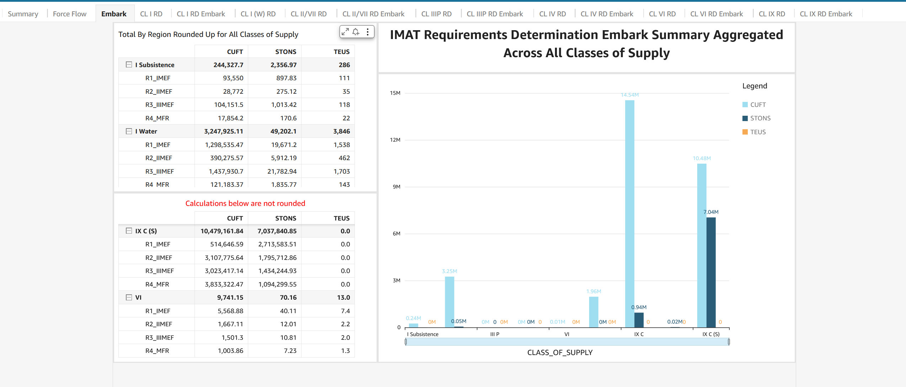
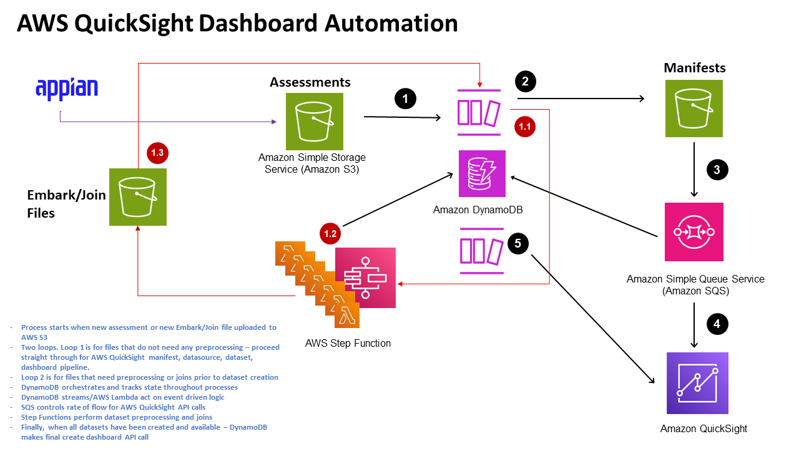
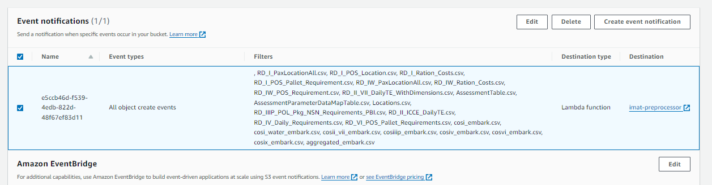
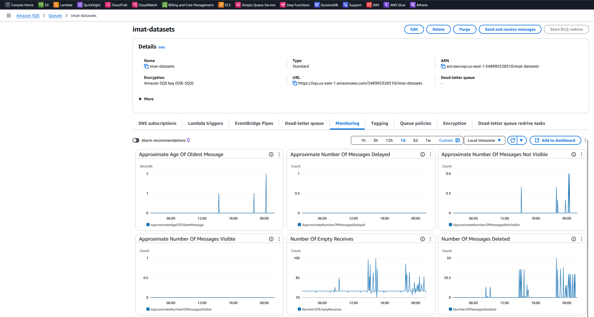
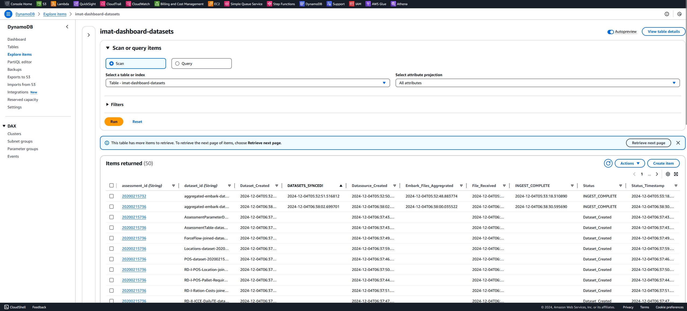
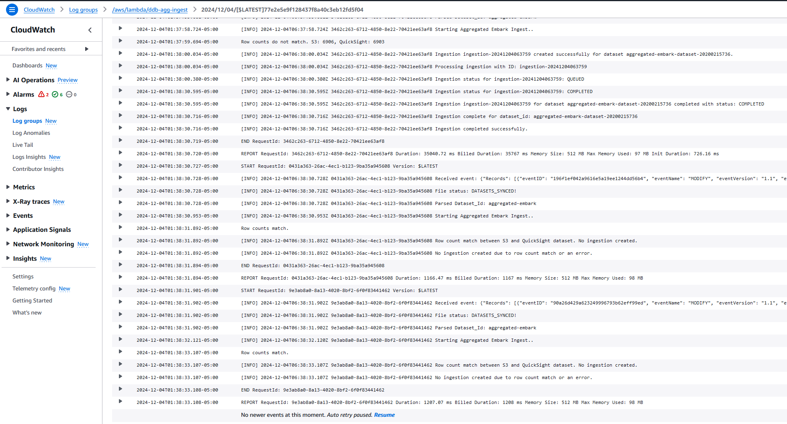
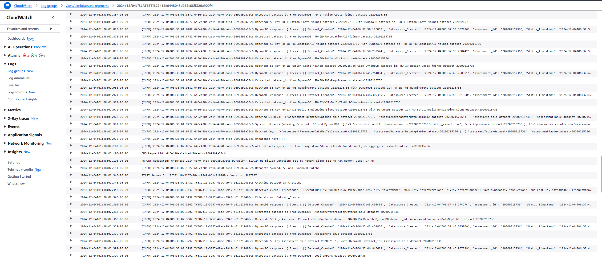
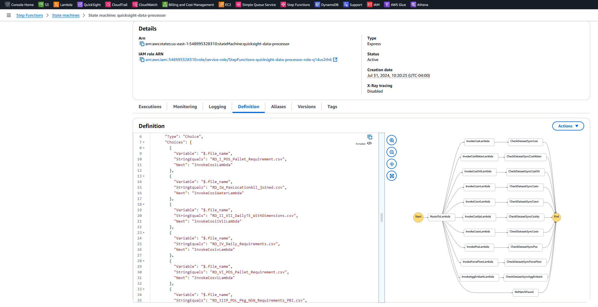
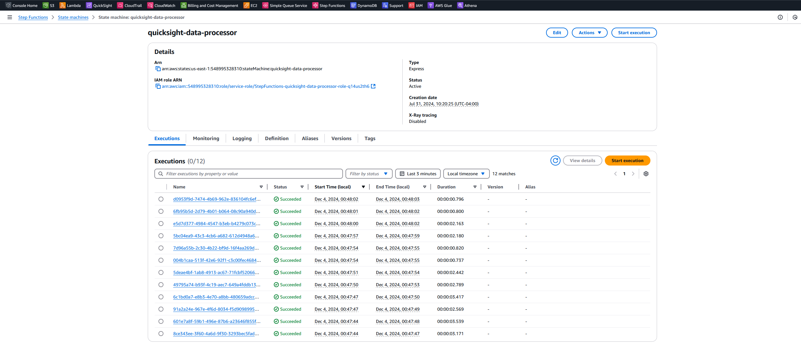

# **AWS QuickSight Dashboard Automation**

## Final Architecture

---

## Workflow

### **1. S3 Alert Trigger**

- Use AWS S3 notifications to trigger Lambda functions. 
- We use suffix keys (file names with extensions) to limit notifications to the exact files we are looking for, reducing unnecessary API calls.

[**S3 Event Triggers**](https://github.com/canallc/quicksight-dashboard-automation/tree/main/setup/s3_events)

---

### **2. Lambda Router**

- Routes messages (S3 Alerts) to AWS Step Function or AWS SQS depending on processing requirements.
- Creates and uploads a manifest file to AWS S3 for QuickSight to read.

---

### **3. SQS Processor**

- APIs are throttled at 5 transactions per second (TPS) per user principal in the account and 25 TPS at the per-account level. 
  Implicitly refilled every second. 
- SQS is used to control the rate of API calls.
- Contains a queue to receive notifications after a QuickSight manifest is created.
- Dataset processing happens here.
- Lambda trigger #2 processes these messages one by one.

[**SQS Setup**](https://github.com/canallc/quicksight-dashboard-automation/tree/main/setup/sqs)

---

### **4. DynamoDB Orchestration**

- Manages state and stores the dataset lifecycle, from creation to dashboard generation.
- Uses state changes and events in DynamoDB to trigger specialized processing by AWS Lambda.

[**Lambda Functions**](https://github.com/canallc/quicksight-dashboard-automation/tree/main/setup/lambda)  
[**DynamoDB/DynamoDB Streams**](https://github.com/canallc/quicksight-dashboard-automation/tree/main/setup/dynamoDB)

---

### **Aggregated Embark Lambda Data Refresh/Data Ingest Function**

- A dedicated Lambda function monitors `aggregated_embark.csv` for row count differences.
- Once the row count is stable after successive aggregations, it calls the data refresh API to update the dataset for the final dashboard.

---

### **Dashboard Processor**

- Listens for the `DATASETS_SYNCED` event and creates dashboards from the dashboard definition file.
- Filters dashboard sheets and visuals based on actual datasets in the assessment.

---

### **5. Step Function**
*(Lambdas #5-#15)*

- Manages dataset preprocessing for aggregations and joins.
- Performs joins and aggregates all Class of Supply Embark files.
- Checks files in AWS S3 against datasets in DynamoDB for sync status.

[**Step Function Setup**](https://github.com/canallc/quicksight-dashboard-automation/tree/main/setup/step_functions)
